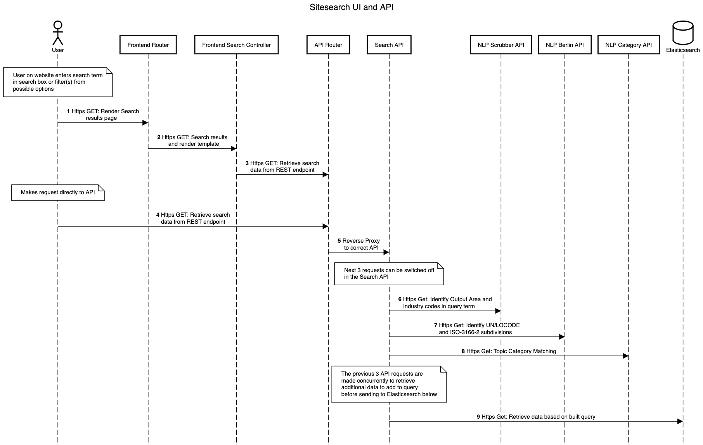
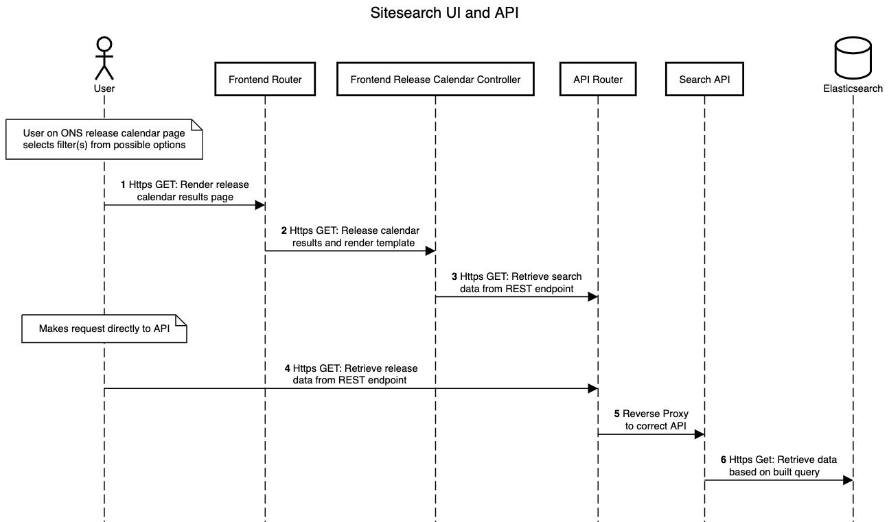
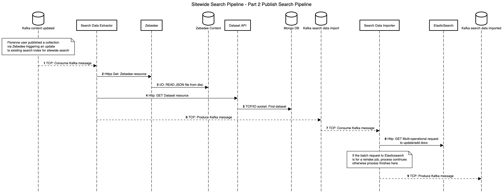
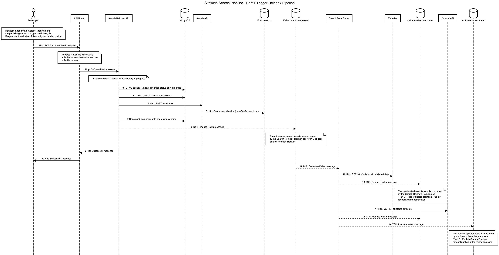
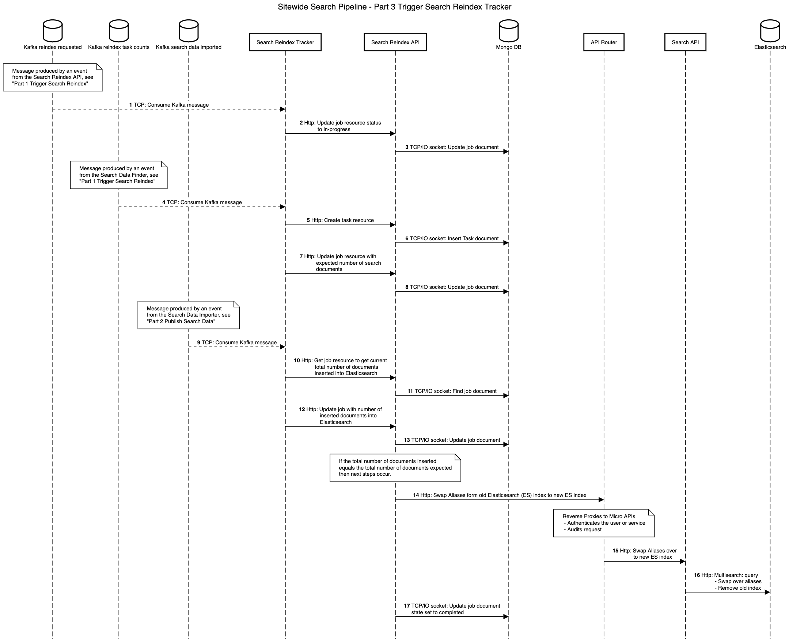

# Search Service Architecture

Source of truth for the application architecture of the ONS search service including backend processing of data. C4 diagrams available via [ONS google drive](https://drive.google.com/drive/folders/1usE1C-VzQIrymSJ7tJzXxXjZAmXLge2S).

## Contents

- [Search Service Architecture](#search-service-architecture)
  - [Contents](#contents)
  - [Sitesearch and other aggregated pages](#sitesearch-and-other-aggregated-pages)
    - [Sitesearch UI \& API](#sitesearch-ui--api)
    - [Release Calendar UI \& API](#release-calendar-ui--api)
  - [Search Data Pipeline](#search-data-pipeline)
    - [Add/update search documents when a collection is published](#addupdate-search-documents-when-a-collection-is-published)
      - [Steps](#steps)
  - [Search Reindex Pipeline](#search-reindex-pipeline)
    - [Trigger Search Reindex Pipeline](#trigger-search-reindex-pipeline)
      - [Steps](#steps-1)
    - [Tracking Search Reindex Job](#tracking-search-reindex-job)
      - [Steps](#steps-2)
  - [Sequence diagrams](#sequence-diagrams)

## Sitesearch and other aggregated pages

### Sitesearch UI & API



Sitesearch dataflow from user on the website making a search with query term and/or selecting filters to retrieving data from backing services and rendering the results.

### Release Calendar UI & API



Dataflow from user on the website hitting the release calendar page on the ONS website, or selecting filters on this page to retrieving data from backing services and rendering the results.

## Search Data Pipeline

### Add/update search documents when a collection is published



The data pipleine from Florence user publishing some new or updated content or data to being stored in Elasticsearch, ready for web or API users to query (via API, e.g. [sitesearch sequence diagram](#sitesearch-ui--api))

#### Steps

Pre-requisite steps to publishing data not in this workflow as we will not be changing that part of the process. The following steps follow
on from a florence (DP internal user) publishes a collection that can contain 1 to many ons webpages or datasets by making a request to zebedee
which does he publishing of new webpages or updates to existing pages and lastly triggering updates to sitewide search; which is where the flow begins.

**1: Consume Kafka messages**

On publishing a collection, consume kafka message

```
Datastore: kafka

Topic: content-updated
Record: {
    "uri": string, // mandatory
    "search_index": string, // mandatory
    "data_type": string, // mandatory
    "collection_id": string, // optional
    "job_id": string // optional (used for reindex pipeline)
}
```

The `search_index` field should be set to the search index alias, `ONS` for publishing new content. Only search reindexes will make use of the actual index name, e.g. `ons_<timestamp>`.

**2: Retrieve Zebedee resource**

Retrieve resource from Zebedee API endpoint based on the uri in kafka maessage.

**3: Read JSON file from disc**

Retrieve single document from zebedee content (files on disc).

**4: Retrieve dataset resource**

Retrieve resource from Dataset API endpoint based on the uri in kafka maessage.

*Note: No parellisation with 2 as each of these are triggered by separate kafka messages*

**5: Find latest version of dataset**

Find one document from Mongo db representing the resource on given uri.

**6: Produce event to search-data-import**

```
Datastore: kafka

Topic: search-data-import
Record: {
    "data_type": string,
    "job_id": string, // empty
    "search_index": string, // Should use search alias ONS
    "cdid": string,
    "dataset_id": string,
    "description": string,
    "edition:: string,
    "keywords": string,
    "meta_description": string,
    "release_date": string // date format: ISO8601 or strict_date_optional_time||epoch_millis to match existing docs in search?
    "summary": string,
    "title": string,
    ... other fields we decide need to be in search
}
```

See [full schema here](https://github.com/ONSdigital/dp-search-data-extractor/blob/develop/schema/schema.go#L25)

**7: Consume event from search-data-import**

Kafka message consumed by Search Data Importer. Documents received via consumption of kafka topic `search-data-import`, store documents in memory until 500 messages consumed or time from first message exceeded 5 seconds before making bulk request. 5 second limit will allow for the last set of messages to still be reindexed.

**Note: For search reindex process, we create separate batches based on the search index name; this way we can insert documents to the correct index for both reindex jobs and publishing new content and data**

**8: Multi-operational request to update/add docs to an index**

```
Datastore: Elasticsearch
Index: ons *or* ons_<timestamp> // should be using the value in consumed kafka event

Method: POST
Header: 'Content-Type: application/json'
Path: /_bulk
Body: { "update": { <search doc - Depends on data type>, "_index": "ONS" } }
```

The search document should set an `_id` field that matches the unique identifier for that document, either uuid or compound identifier (multiple fields to represent a documents uniqueness). Either way this should be determined by the data stored in Zebedee content and the dataset API.


See [Bulk API](https://www.elastic.co/guide/en/elasticsearch/reference/current/docs-bulk.html)

**9: Produce event to search data imported**

If the batch of documents was for a reindex job, then produce event for the search reindex tracker.

```
Datastore: kafka

Topic: search-data-imported
Record: {
    "job_id": string, // mandatory
    "number_of_search_documents // mandatory
}
```

See [Tracking Search Reindex Job](#tracking-search-reindex-job) to continue following this part of the "Search Reindex Pipeline" process.

## Search Reindex Pipeline

The search reindex pipleine triggered by developer via Search Reindex API and the finding content and data before storing in Elasticsearch, ready for web or API users to query (via API, e.g. [sitesearch sequence diagram](#sitesearch-ui--api))

Sequence diagram split between 3 parts:

1. [Search Reindex Pipeline](#search-reindex-pipeline)
1. [Search Data Pipeline](#search-data-pipeline)
1. [Tracking Search Reindex Job](#tracking-search-reindex-job)

### Trigger Search Reindex Pipeline



#### Steps

**1: Http POST Reindex job via API Router**

```
Path: /jobs
Path parameters: none
Header: Authorization: Bearer <token>
Body: none
```
**2: Reverse Proxy to Search Reindex (micro) API**

API router will authenticate the user or service before sending
on request via reverse proxy and then store the outcome in audit system.

**3: Retrieve list of in-progress jobs**

```
Datastore: mongoDB
Database: search
Collection: jobs
Query: Filter job docs by state and time

BSON Document: {
    "state": string, // enumurated list, in-progress, failed, completed
    "reindex_started": ISODate, // ISO8601 timestamp,
    "id": string,
    ...
}
```

**Validation** - Check there are no jobs that are in-progress and created within the last hour (depends on how long a reindex takes).
If validation fails return status code 409 (conflict), message 'existing reindex job in progress'.

**4: Create new job doc in mongoDB**

```
Datastore: mongoDB
Database: search
Collection: jobs
Query: Insert

BSON Document: {
    "id": string, // Generated unique id
    "last_updated": ISODate, // ISO8601 timestamp
    "links" : {
        "self" : string, // format: http://localhost:<PORT>/jobs/<id>
        "tasks": string, // format: http://localhost:<PORT>/jobs/<id>/tasks
    },
    "reindex_completed": ISODate, // Empty
    "reindex_failed": ISODate, // Empty
    "reindex_started": ISODate, // ISO8601 timestamp
    "search_index_name": string, // format: {ONS-<ISO8601 timestamp>}
    "state": string // set to in-progress
}
```

**5: Create new sitewide search index via Search API**

Call search API to create new index.

```
Method: POST
Path: /search
```

Response must include the search index name.

**6: Create new sitewide search index (ONS_<timestamp>)**

Call elasticsearch cluster to create new index.

```
Index: ONS-<ISO8601 timestamp>
```

**7: Update job document with search_index_name**

```
Datastore: mongoDB
Database: search
Collection: jobs
Query: Upsert
Document Identifier: job_id

BSON Document: {
    "last_updated": ISODate, // ISO8601 timestamp
    "search_index_name": string // format: {ONS-<ISO8601 timestamp>}
}
```

**8: Send kafka messages**

Send a message to kafka topic

```
Datastore: kafka

Topic: reindex-requested
Record: {
    "job_id": string,
    "search_index": string
}
```

**9 & 10: Successful response**

```
Status Code: 201
Body: {
    "id": string, // unique id for job
    "last_updated": ISODate, // ISO8601 timestamp
    "links" : {
        "self" : string // format: http://localhost:<PORT>/jobs/<id>
        "tasks": string // format: http://localhost:<PORT>/jobs/<id>/tasks
    },
    "reindex_started": ISODate, // ISO8601 timestamp
    "search_index_name": string, // format: {ONS-<ISO8601 timestamp>}
    "state": string // set to in-progress
    "total_search_documents": integer
}
```

**11: Consume Kafka message from reindex-requested**

1. Search Reindex Tracker consumes message, see [Tracking Search Reindex](#tracking-search-reindex-job)
1. Search Data Finder consumes message, continue

```
Datastore: kafka

Topic: reindex-requested
Record: {
    "job_id": string, // mandatory
    "search_index": string // mandatory
}
```

See schema [here](https://github.com/ONSdigital/dp-search-data-finder/blob/develop/schema/schema.go)

**12: Retrieve a list of urls for all published data on Zebedee**

By calling the published data endpoint

**13: Produce Kafka message to reindex-task-counts for Zebedee uris**

Search Reindex Tracker consumes message, see [Tracking Search Reindex](#tracking-search-reindex-job)

```
Datastore: kafka

Topic: reindex-task-counts
Record: {
    "job_id": string, // mandatory
    "task": string, // mandatory
    "extraction_completed": bool, // mandatory
    "count": integer // mandatory
}
```

See schema [here](https://github.com/ONSdigital/dp-search-data-finder/blob/develop/schema/schema.go)

Continuation of Search Reindex takes place by the Search Reindex Tracker consuming messages from the `reindex-task-counts` topic.

**14: Retrieve a list of urls for all published data on Dataset API**

By calling the datasets endpoint, then dataset editions endpoint.

**Note: Step 14 can be done in parallel with 12**

**15: Produce Kafka message to reindex-task-counts for dataset API uris**

See Step 13

**15: Produce Kafka message per url to content-updated topic**

For every url returned by Zebedee and the dataset API, there should be an equivalent message produced to the `content-updated` topic.

```
Datastore: kafka

Topic: content-updated
Record: {
    "uri": string, // mandatory
    "job_id": string, // mandatory
    "search_index": string, // mandatory
    "data_type": string // mandatory
}
```

See schema [here](https://github.com/ONSdigital/dp-search-data-finder/blob/develop/schema/schema.go)

Continuation of Search Reindex takes place by the Search Data Extractor consuming messages from the `content-updated` topic; see [Search Reindex Pipeline](#search-reindex-pipeline)

### Tracking Search Reindex Job



#### Steps

**1: Consume Kafka message from kafka reindex requested**

Tracker identifies a reindex job has started

```
Topic: reindex-requested
Record: {
    "job_id": string, // mandatory
    "search_index": string // mandatory
}
```

See schema [here](https://github.com/ONSdigital/dp-search-reindex-tracker/blob/develop/schema/schema.go)

**2: Update Reindex job - state to in-progress**

```
Method: PATCH
Path: /jobs/{id}
Body: [
    {
        "op": "replace",
        "path": "/state",
        "value": "in-progress"
    }
]
```

See [Search Reindex API swagger spec](https://github.com/ONSdigital/dp-search-reindex-api/blob/develop/swagger.yaml)

**3: Update reindex job document**

```
Datastore: mongoDB
Database: search
Collection: jobs
Query: FindOne
Document Identifier: job_id

BSON Document: {
    "state": "in-progress"
}
```

**4: Consume Kafka message from kafka reindex task counts**

Tracker consumes messages from the reindex task counts topic, to update
the number of expected documents to be stored in Elasticsearch index
against a single task of a job.

```
Topic: reindex-task-counts
Record: {
    "job_id": string, // mandatory
    "task": string, // mandatory
    "extraction_completed": bool, // mandatory
    "count": integer // mandatory
}
```

If the extraction_completed is set to true then the Search Reindex Tracker will
need to update the flag against the reindex job. See next step.

See schema [here](https://github.com/ONSdigital/dp-search-reindex-tracker/blob/develop/schema/schema.go)

**5: Create task for Reindex Job**

```
Method: POST
Path: /jobs/{id}/tasks
Body: {
    "task_name": <string value retrieved from event (task)>,
    "number_of_documents": <integer value retrieved from event (count)>
}
```

**6: Insert Task document**

```
Datastore: mongoDB
Database: search
Collection: tasks
Query: Insert
Document Identifier: task_name

BSON Document: {
    "task_name": <string, value received from kafka message (task)>,
    "job_id": <string, value retrieved from kafka message (job_id)>,
    "number_of_documents": <integer, value received from kafka message (count)>
}
```

**7: Update Reindex job - number_of_tasks**

```
Method: PATCH
Path: /jobs/{id}
Body: [
    {
        "op": "add",
        "path": "/total_search_documents",
        "value": <integer value retrieved from event (count)>
    },
    {
        "op": "add",
        "path": "number_of_tasks",
        "value": 1
    },
    {
        "op": "replace",
        "path": "extraction_completed",
        "value": <boolean value retrieved from event>
    }
]
```

If we are not handling add operation, then the Search Import Tracker will need to make GET request before using PATCH and calculate the actual values for `number_of_tasks` and `total_search_documents` and then use PATCH endpoint with replace operator.

Do a read request and then write request (GET then PATCH) can introduce data races across microservices, so would need to use ETag header on GET response and add to IF-Match header on PATCH request to prevent updating job incorrectly. Possibility of getting a conflict, so will need to reprocess both GET and PATCH.

**8: Update job document**

```
Datastore: mongoDB
Database: search
Collection: jobs
Query: Update
Document Identifier: job id

BSON Document: {
    "total_search_documents": <new count value>,
    "number_of_tasks": <new number of tasks value>,
    "extraction_completed": <bool value from kafka message>
}
```

**9: Consume Kafka message from kafka search-data-imported**

Tracker consumes messages from the search data imported topic, to update
the number of documents that have now been stored in the new Elasticsearch index
against a job.

```
Topic: search-data-imported
Record: {
    "job_id": string, // mandatory
    "number_of_search_documents": integer // mandatory
}
```

See schema [here](https://github.com/ONSdigital/dp-search-reindex-tracker/blob/develop/schema/schema.go)

**10: Get Reindex job**

```
Headers: Authorisation
Method: GET
Path: /jobs/{id}
```

Keep hold of the ETag for next step used in the If-Match header.

Combine the value of the `total_inserted_search_documents` with the
`number_of_search_documents` from kafka message to represent the new
`total_inserted_search_documents` value used in PATCH reuest.

Check the new value for `total_inserted_search_documents` matches the `total_search_documents` field in job document. If they are the same and the
`extraction_completed` is set to true then the `state` will need to be updated
to `completed` as part of the step 12.

**11: Find Reindex job**

```
Datastore: mongoDB
Database: search
Collection: jobs
Query: FindOne
Document Identifier: job id
```

**12: Update Reindex job - total_inserted_search_documents**

```
Headers: Authorisation, If-Match
Method: PATCH
Path: /jobs/{id}
Body: [
    {
        "op": "replace",
        "path": "/total_inserted_search_documents",
        "value": <integer>
    },
    {
        "op": "replace",
        "path": "state",
        "value": "completed" // only if the total_inserted_search_documents is equal to the total_search_documents
    }
]
```

Possibility of getting a conflict, so will need to reprocess both GET request in step 10 and PATCH in step 11.

**13: Update Reindex job**

```
Datastore: mongoDB
Database: search
Collection: jobs
Query: Update
Document Identifier: job id

BSON Document: {
    "total_inserted_search_documents": <integer>,
}
```

**14: Search Reindex API requests alias swap and deletion of previous index**

```
Headers: Authorisation
Method: POST
Path: /search/{index}/aliases/{alias} // alias should always be "ONS"
Query Params
  - delete_current_aliased_index = bool (true/false)
```

**15: API router reverse proxies request to alias swap and deletion of previous index**

Request hits the API router before reaching Search API (step 15)

API router will authenticate the user or service before sending
on request via reverse proxy and then store the outcome in audit system.

**16: Multi-operational request to update aliases**

See [index alias API](https://www.elastic.co/guide/en/elasticsearch/reference/current/indices-aliases.html) to see how this is done

```
Datastore: elasticsearch

Method: POST
Path: /_aliases
Body: {
    "actions" : [
    {"remove": {"index" : "<old-index>", "alias" : "ONS"}},
    {"add" : {"index" : "<new-index>", "alias" : "ONS" }},
    {"remove-index" : {"index" : "<old-index>"}}, // assuming `delete_current_aliased_index` was set to true otherwise dont include
  ]
}
```

**17: Update Reindex job state to completed**

```
Datastore: mongoDB
Database: search
Collection: jobs
Document Identifier (id): job.id

BSON Document update: {
    "last_updated": ISODate, // ISO8601 timestamp
    "reindex_completed": ISODate,
    "state": "completed"
}
```

**Note**

If the reindex job fails, we should be updating the job document accordingly with a `"reindex_failed": ISODate, "state": "failed"`.

Update Reindex Job state to failed

Search Reindex API -> datastore

```
Datastore: mongoDB
Database: search
Collection: jobs
Document Identifier (id): job.id

BSON Document update: {
    "last_updated": ISODate, // ISO8601 timestamp
    "reindex_failed": ISODate,
    "state": "failed"
}
```

## Sequence diagrams

To update the diagrams, see [sequence diagrams documnetation](sequence-diagrams/README.md)
